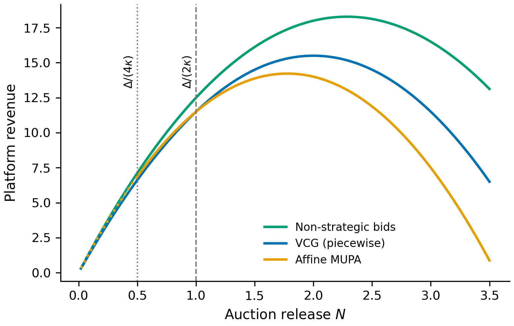
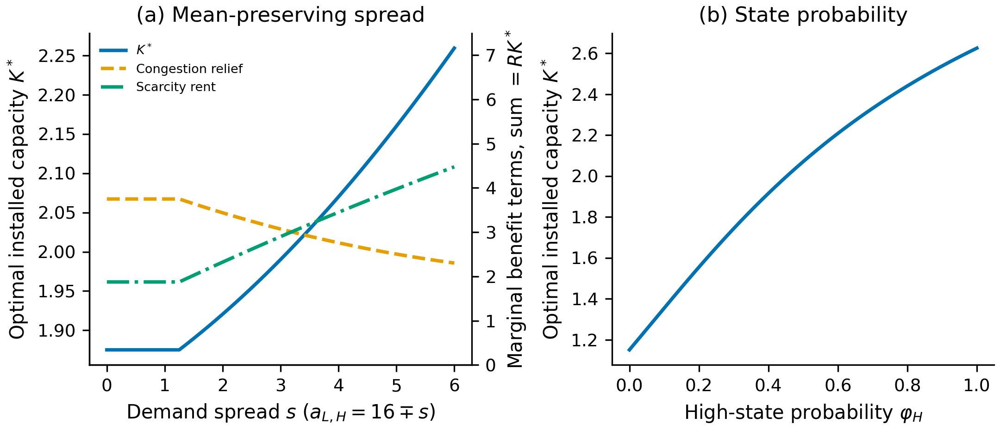
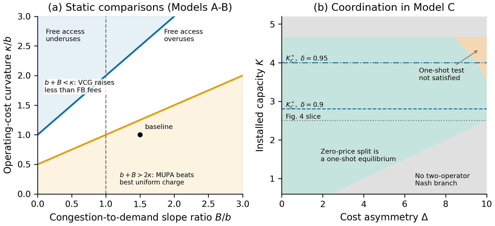

# Low-altitude corridor: reproducible figures

**论文 8 张图的可复现代码、参数和绘图说明。** 对应论文 *When Does Congestion Justify Access Charges? Pricing, Auctions, and Capacity Release in Low-Altitude Logistics Corridors* 的 2026-09-30 Overleaf 版本。

本仓库依据正文、附录公式及原图重新实现 Python 程序。Overleaf 文件树未包含原始绘图脚本，因此这里是**公式与数值结果的复现**，不是声称找回了作者原程序，也不保证逐像素或 PDF 字节相同。原图保留在 `reference_figures/`，重新生成的图保存在 `figures/`。

## 一键复现

已在 Python 3.13 / NumPy 2.4.6 / SciPy 1.17.1 / Matplotlib 3.10.6 上运行验证。

```bash
git clone https://github.com/yqdiao/low-altitude-corridor-reproducibility.git
cd low-altitude-corridor-reproducibility
python3 -m venv .venv
source .venv/bin/activate
python -m pip install -r requirements.txt
python reproduce.py
python -m unittest discover -s tests -v
```

Windows 激活环境使用 `.venv\Scripts\activate`。绘图无需安装 LaTeX，无需 Overleaf 或 GitHub 登录，也无需下载实测数据。所有图来自论文的解析公式与一维数值求根；不使用随机抽样，因此无需随机种子。

只画一张图，或将结果输出到另一个目录：

```bash
python reproduce.py --figure 7
python reproduce.py --config config/parameters.json --output /tmp/corridor-results
```

修改 [config/parameters.json](config/parameters.json) 即可调整参数；每个网格的三个数字是 `[起点, 终点, 点数]`。改变参数可能使候选解离开论文假设区域，程序将报错或通过数据中的有效性标记指出，而不会把外推解释为均衡。

## 每张图画什么

| 图 | 文件名 | 横轴 / 特定参数 | 计算方法 |
|---|---|---|---|
| 1 | `fig1_revenue_ranking` | N = 0.02–3.5；Δ=2 | 非策略报价、分段 VCG、仿射 MUPA 收入 |
| 2 | `fig2_mechanism_quantities` | α=1–4；A: Δ=7.5；B: Δ=10、平均成本=6 | Model A 内点/退出解；Model B 供给候选及有效区域 |
| 3 | `fig3_objective_ratio` | α=1–3.5；Δ=0、2、4 | 各机制自身最优选择下的 OF_M / OF_A |
| 4 | `fig4_coordination_threshold` | Δ=0–5；K=2.5 | 两个运营商的重复博弈阈值取最大值 |
| 5 | `fig5_capacity_comparison` | R=1.3–8；α=2、r=30 | Nash 与协调容量；交点 R=b+3κ=4 |
| 6 | `fig6_state_contingent_release` | K=0.55–4.5；α=1.5；a_L=12、a_H=20 | 释放一阶条件的正根，截断于 N≤K |
| 7 | `fig7_investment_uncertainty` | s=0–6 / 高状态概率=0–1；α=1.5、δ=.9、r=30 | 逐状态释放 + 投资包络条件求根 |
| 8 | `fig8_regime_maps` | B/b、κ/b=0–3；Δ=0–10、K=.6–5.2 | 静态阈值 + 一次博弈零价格均衡检验 |

详细公式、参数含义、图中每条线怎么计算，见 **[中文逐图说明](docs/figure_guide_zh.md)**；来源与复现边界见 **[来源及核验记录](docs/provenance_and_validation.md)**。

## 文件结构

- `corridor/models.py`：模型公式、分段解、有效性检查、数值求解。
- `reproduce.py`：八张图的绘制与 CSV 导出。
- `config/parameters.json`：全部数值参数、扫描区间与网格点数。
- `figures/`：8 张 PDF 矢量图及 8 张 300 dpi PNG。
- `data/`：10 个 CSV，包括双面板数据、有效区域标记和求根残差。
- `reference_figures/`：从论文编译 PDF 提取的 8 张原始矢量图及来源哈希。
- `tests/`：10 项自动测试，包含独立优化器核对、会计恒等式、论文数值与边界。
- `scripts/`：原图提取、原 PDF 曲线数值核验工具（可选）。
- `reproduction_manifest.json`：运行环境、参数哈希、输出文件 SHA-256。
- `.github/workflows/reproduce.yml`：自动安装依赖、运行测试及生成全部图。

## 已验证结果与需留意的原图边界

- 论文福利分解表中的 Model A / MUPA 数值通过三位小数精度核对。
- 图 5 的容量交点为 R=4；图 7 的小离散度容量为 1.875，s=6 时约为 2.26。
- 对图 1、3、4、5、6，直接提取原 PDF 曲线顶点并换算成数据坐标；12 段曲线的最大绝对数值误差低于 4×10⁻⁶。完整结果见 [reference_curve_audit.json](docs/reference_curve_audit.json)。
- **图 1**：原图的非策略收入曲线在 N<Δ/(2κ)=1 时延长了内点公式；CSV 同时提供按退出条件正确分段的 `U_NS_piecewise`。MUPA 在 N≤.5 的点线也是外推。
- **图 8(b)**：为对应原图，仍显示 Δ 到 10；但平均成本=4 时，Δ≥8 意味着 t₁≤0，超出论文的正成本假设。CSV 的 `primitive_cost_valid` 明确标记这些点。不要将该区域解释为满足全部原始假设的经济情形。

参数是归一化的示例场景，**不是深圳走廊的实证估计**。本仓库不对原 Overleaf 论文进行修改。

## 预览





## 可选：重新核验原始 PDF 曲线

```bash
python -m pip install -r requirements-audit.txt
python scripts/audit_reference_curves.py
# 如拥有论文编译 PDF，可重新提取矢量图：
python scripts/extract_reference_figures.py /path/to/paper.pdf
```

可选工具使用已保存的 PDF，无需原 Overleaf 编辑链接。仓库不包含访问令牌、登录信息或完整论文全文。未擅自替作者选择开源许可证；代码与论文图形的再分发授权应由权利人决定。
